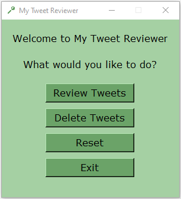
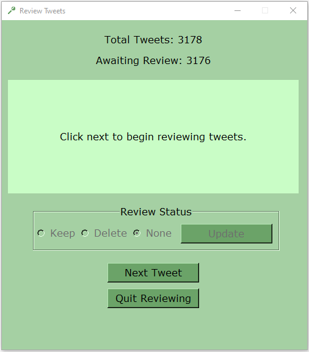
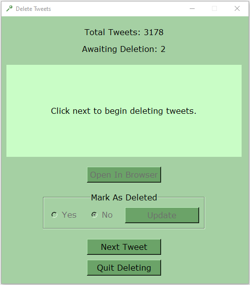
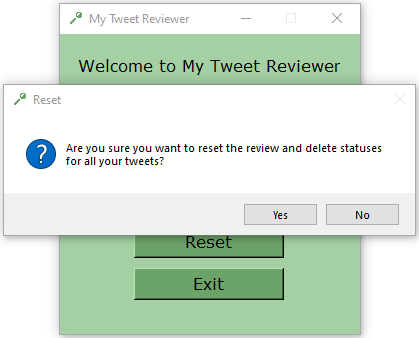

# my-tweet-reviewer-GUI

## Introduction

My Tweet Reviewer GUI allows you to review each of the tweets in your downloaded Twitter data and to conveniently open those you choose to delete in your internet browser for quick removal. While providing the same functionality as the text based [My Tweet Reviewer](https://github.com/MatthewCarterIO/my-tweet-reviewer), the graphical user interface of My Tweet Reviewer GUI makes the review process a little more user-friendly.

This is not designed to be a bulk tweet review or delete program; it is intended to offer control for a more considered approach. To support this, the review process can be done offline and progress can be saved at any point and resumed at a later time.

## Installation

### Prerequisites

* [python 3.7.3](https://www.python.org/)
* [pandas 0.25.0](https://pandas.pydata.org/index.html)
* [tkinter 8.6](https://docs.python.org/3/library/tkinter.html)
* tweet.js

### Getting Started

1. Download or update Python, the pandas library and the tkinter package as required. 
2. Request and download the Twitter data from the account you wish to review.
3. Copy the `tweet.js` file from your downloaded data into the same folder as the `my_tweet_reviewer_GUI.py` file.
4. Open `my_tweet_reviewer_GUI.py` in your desired environment.

## Usage

A CSV file is created from `tweet.js` and is updated as you progress through the review and delete processes. The columns in the CSV file are as follows:

- `tweet_created` - Date the tweet was created.
- `tweet_id` - Unique ID of the tweet.
- `tweet_text` - Text of the tweet.
- `tweet_url` - Web address for the tweet.
- `hashtag_X` - One column allocated to each of the hashtags in the tweet.
- `tweet_review_status` - The review status you assign to the tweet during the review process.
- `tweet_url_visited` - Whether the tweet has been opened in the browser during the delete process.
- `tweet_deleted` - Whether the tweet has been deleted during the delete process.

During the review process, tweets are marked to keep or delete. Any tweets marked for deletion can then be automatically opened in your internet browser one at a time during the delete process, allowing you to quickly remove them without needing to scroll through all of your tweets to search for them. It is not necessary to review all tweets before deleting, tweets can be deleted at any time.

This program can largely be used offline, but to delete tweets you need to be online and logged into your Twitter account (to access delete option).

### Initial Setup

Prior to running the program locate and complete the section of code shown below:

```python
if __name__ == "__main__":
    excluded_hashtags_list = ["hashtag1", "hashtag2", "hashtag3"]
    main("@yourusername", excluded_hashtags=excluded_hashtags_list, saved_filename="my_tweet_review.csv")
```

- `username` (Required) - Your Twitter username including '@' symbol.
- `excluded_hashtags` (Optional) - A list of hashtags included in tweets you do not want/need to review (without the '#' character).
- `saved_filename` (Optional) - Name of the new CSV save file to create if one doesn't exist, or that currently exists and you wish to continue using.

### Main Window

Starting the program opens the main window which presents four options: `Review Tweets`, `Delete Tweets`, `Reset` or `Quit` which are elaborated on below.



### Review Tweets Window

Starts or resumes the review process by loading the contents of the CSV into a pandas DataFrame. The `tweet_review_status` column in the DataFrame will be updated during the review process. The DataFrame will be used to overwrite the CSV file if a save is performed. The total number of tweets in the CSV is displayed at the top of the window along with the number of those still awaiting review.

1. Click on `Next Tweet` to show the first tweet for review or `Quit Reviewing` to exit immediately without saving. If there are no tweets to review, a message will be shown and the only available option will be to quit.
2. Select the desired review status for the displayed tweet (by default it is `None`). The choices are:
- `Keep` - Tweet will be kept in the CSV and will not shown again for review.
- `Delete` - Tweet will be marked for deletion in the CSV, awaiting the start of the delete process.
3. Once a review status has been chosen, click the `Update` button which is now enabled to mark the tweet in the DataFrame with the desired status. 
4. Following an update the `Update` button is once again disabled and the `Next Tweet` button is enabled. Now you can either continue reviewing tweets or click `Quit Reviewing` to exit.
5. Quitting stops the review process and if at least one update has been performed the save popup is displayed, giving you the opportunity to save your progress to the CSV: 
- `Yes` - Save DataFrame to the CSV, overwriting any existing data.
- `No` - Exit without saving. Any unsaved progress will be lost and tweets will have to be reviewed again. Closing the Review Tweets window without using the `Quit Reviewing` button also exits without a save operation.



### Delete Tweets Window

Starts or resumes the delete process by loading the contents of the CSV into a pandas DataFrame. The `tweet_url_visited` and `tweet_deleted` columns in the DataFrame will be updated during the delete process. The DataFrame will be used to overwrite the CSV file if a save is performed. The total number of tweets in the CSV is displayed at the top of the window along with the number of those awaiting deletion.

1. Click on `Next Tweet` to show the first tweet for deletion or `Quit Deleting` to exit immediately without saving. If there are no tweets to delete, a message will be shown and the only available option will be to quit.
2. Open the tweet in your internet browser using the `Open In Browser` button and delete the tweet as normal. 
3. Upon returning to the GUI, the option to mark the tweet as deleted becomes available. Take care with this step as data may be removed from your CSV based on your choice: 
- `Yes` - Tweet will be removed from the CSV. 
- `No` - Tweet will remain in the CSV but will not be shown again for review or deletion until a reset or a manual edit of the CSV file has been done.
4. Once a deleted status has been chosen, click the `Update` button which is now enabled to mark the tweet in the DataFrame with the desired status. 
5. Following an update the `Open In Browser` and `Update` buttons are once again disabled and the `Next Tweet` button is enabled. Now you can either continue deleting tweets or click `Quit Deleting` to exit.
6. Quitting stops the delete process and if at least one update has been performed the save popup is displayed, giving you the opportunity to save your progress to the CSV: 
- `Yes` - Save DataFrame to the CSV, overwriting any existing data.
- `No` - Exit without saving. Any unsaved progress will be lost regardless of whether tweets have been deleted or not. Closing the Delete Tweets window without using the `Quit Deleting` button also exits without a save operation.



### Reset

Resets the values in the `tweet_review_status`, `tweet_url_visited` and `tweet_deleted` columns for all tweets in the CSV file, allowing the review and delete processes to be restarted. The reset popup is displayed with the choices: 
- `Yes` - Reset and automatically save DataFrame to the CSV, overwriting any existing data.
- `No` - Cancel reset.



### Quit

Exits the program without saving.

## Testing

The program was last tested with the `tweet.js` format as of 31/07/2019. 

## Author

**Matthew Carter** - [MatthewCarterIO](https://github.com/MatthewCarterIO)